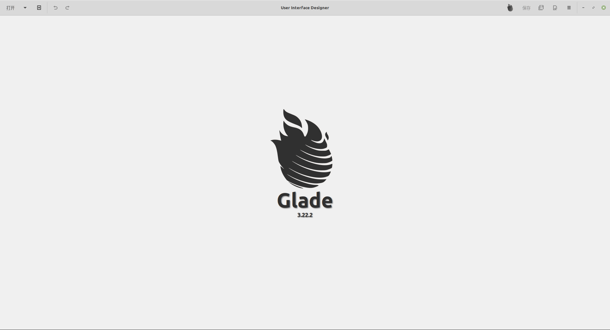
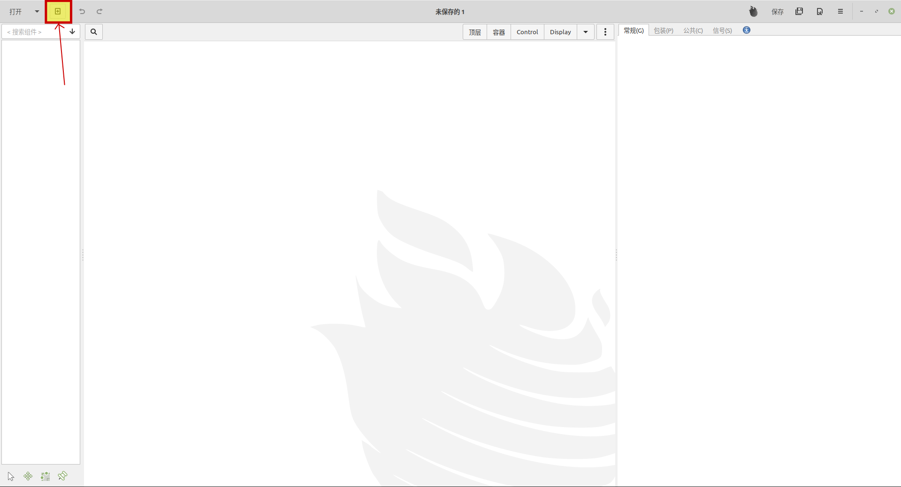
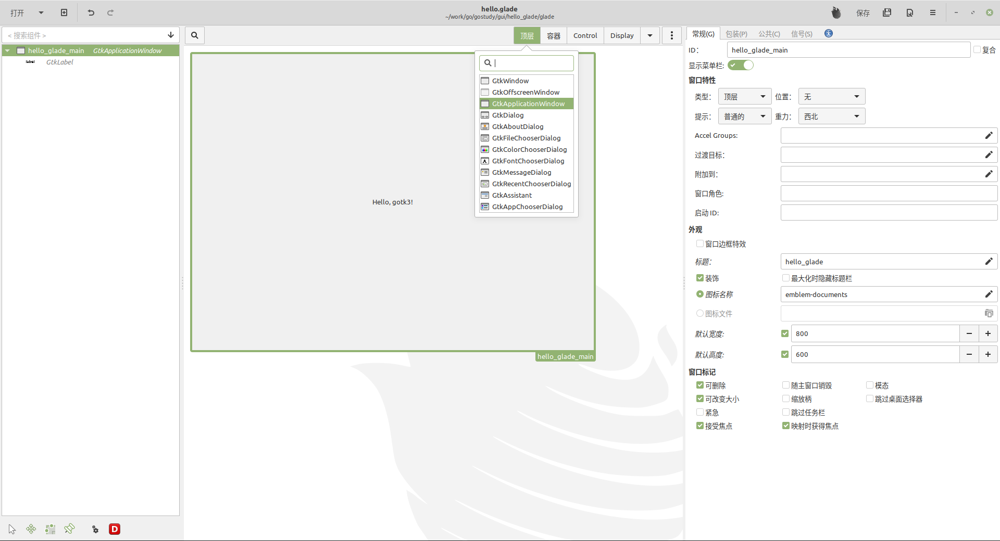
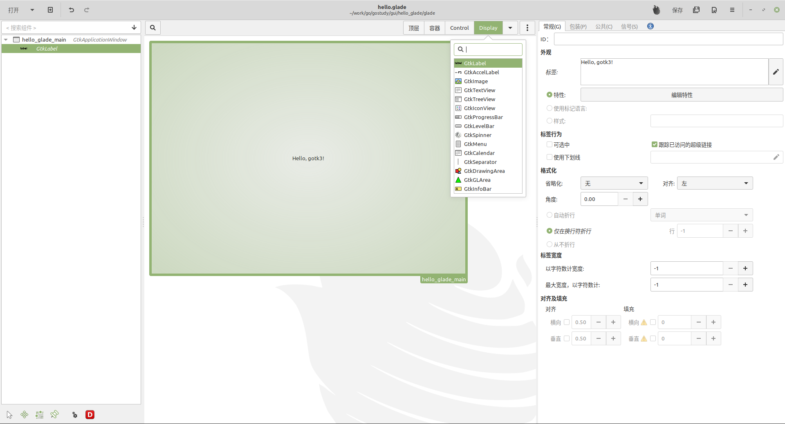
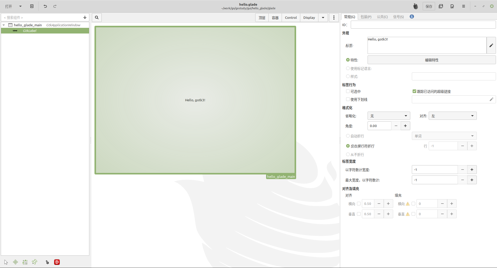

# gotk3 及 glade 使用

## 安装 glade

### debain 安装
```bash
sudo apt install glade
```

## 制作 glade 文件

- 打开 glade 用户界面设计器

- 创建新工程

- 创建顶级窗口

- 创建展示文字的 Lable

- 保存文件到 gostudy/gui/hello_glade


## 编写 go 文件

文件中有详细的注释